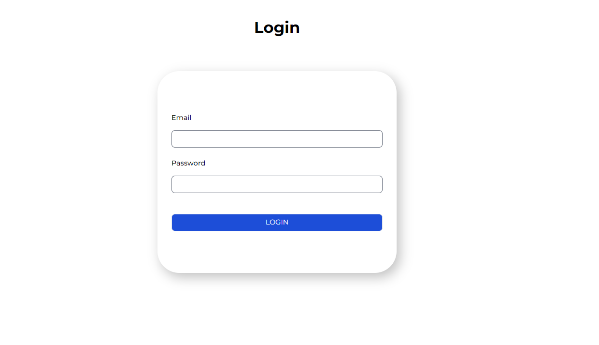
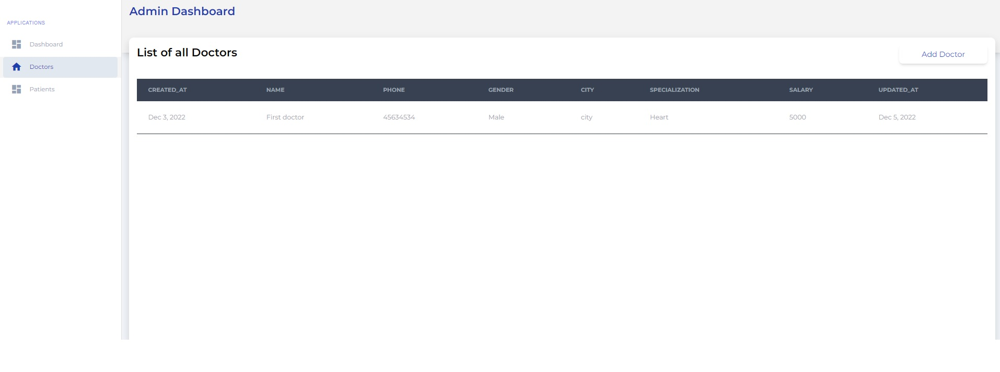
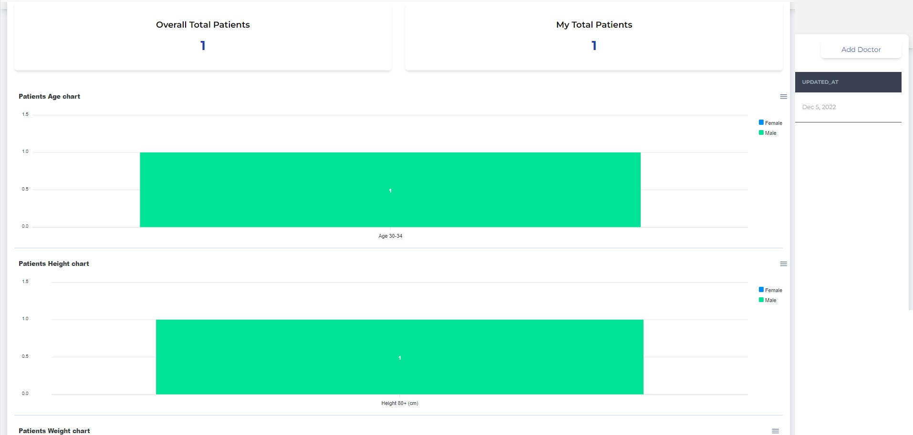
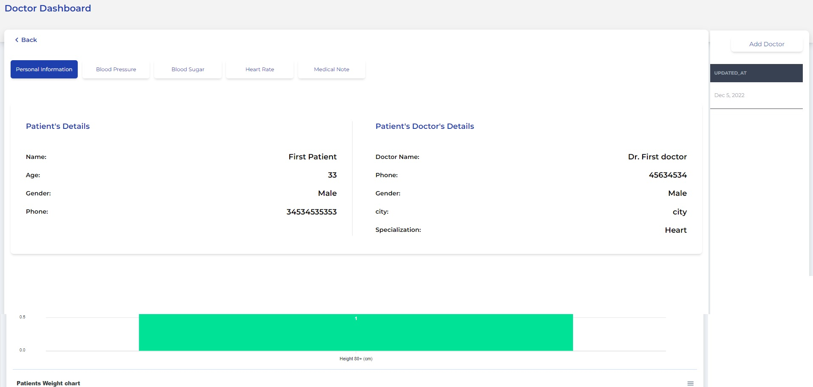

# Medical Application

## Instalation

In each folder need to run command `npm install` to install all dependencies.

## Start application

Run `npm start` in each folder to run server and app. Navigate to `http://localhost:4200/`. The app will automatically reload if you change any of the source files.

## Quick brief of application

Medical application is the app that allow to create doctors and patients for each doctor. Application is still in the development.
All users are verified by the email. To create the admin user use postman to run api call: `http://localhost:3003/v1/auth/register`, and set body:
`{
"name": "Admin",
"email": "admin@gmail.com",
"password": "admin1234",
"role": "admin",
"phone": "6387168393",
"gender": "Male"
}`

## View of the application

### Admin view

Application start screen
Login as a admin user.

To add the new doctor switch to tab "Doctors" and use button "Add Doctor".

Then you will get the email to verify the user and to set the new password. From now you will be able to login to the app as the doctor.

### Doctors view

As a doctor you will be able to add new patient but other than that you will be able to see the whole list of the patients and the personal data of each patient.
Other than that you call also for each patient add the new blood pressure, blood sugar and Heart rate measurement and the medical note.

